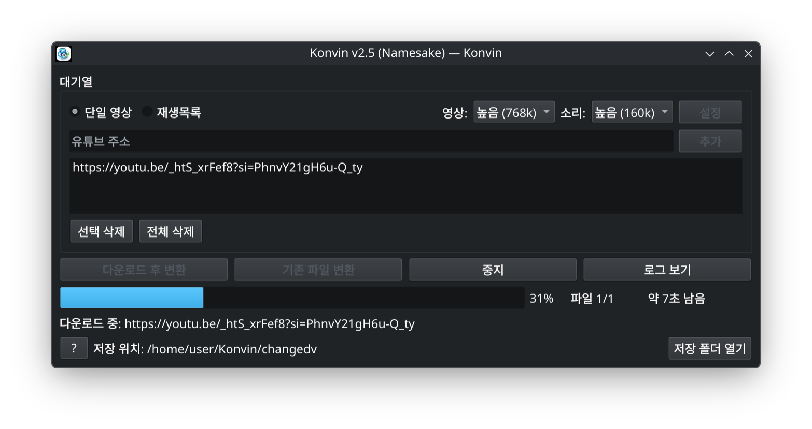

<div align="center">


# Konvin

**유튜브 영상을 클릭휠 아이팟에서 볼 수 있게 바꿔 줍니다.**

*Turns YouTube videos into something a click-wheel iPod can play.*

[](LICENSE)



</div>

---

## 무엇을 하는 프로그램인가요

주소를 붙여 넣으면 영상을 받아서, 클릭휠 아이팟이 재생할 수 있는 형식으로 바꿔 줍니다.
해상도·코덱·비트레이트를 매번 맞출 필요 없이 버튼 하나로 끝납니다.

출력 형식은 iPod Classic 5세대 기준입니다.

| 항목 | 값 |
|---|---|
| 컨테이너 | MP4 (`.m4v`) |
| 영상 | H.264 Constrained Baseline, Level 3.0 |
| 해상도 | 320×240 (원본 비율 유지, 레터박스) |
| 영상 비트레이트 | 384k / 700k / 768k 중 선택 |
| 소리 | AAC-LC, 44.1kHz, 스테레오 |
| 소리 비트레이트 | 96k / 128k / 160k 중 선택 |

영상과 소리 품질은 따로 고를 수 있습니다. 음악 위주의 영상이라면 영상을 낮게,
소리를 높게 두는 식으로 조합하면 됩니다.

## 주요 기능

- 단일 영상과 재생목록 모두 지원 (재생목록은 파일 이름에 순번이 붙습니다)
- 여러 주소를 대기열에 넣고 한 번에 처리
- 이미 받은 영상은 자동으로 건너뜀
- 진행률과 남은 시간 표시
- 중단해도 망가진 파일이 남지 않고, 이어서 변환 가능
- 작업이 끝나면 시스템 알림
- 쌓인 파일을 폴더별로 정리하는 기능
- 한국어 / English

## 설치

### 1. ffmpeg 설치

배포판 패키지 관리자로 먼저 설치해 주세요.

```bash
sudo pacman -S ffmpeg        # Arch, Manjaro
sudo apt install ffmpeg      # Debian, Ubuntu, Mint
sudo dnf install ffmpeg      # Fedora
sudo zypper install ffmpeg   # openSUSE
```

### 2. Konvin 설치

```bash
git clone https://github.com/VertigoJang/konvin.git
cd konvin
./install.sh
```

Python 가상 환경과 필요한 패키지는 처음 실행할 때 알아서 준비됩니다.
관리자 권한은 필요하지 않으며, 모든 파일은 홈 디렉터리 안에만 설치됩니다.

> Python 3.10 이상이 필요합니다. 대부분의 배포판에는 이미 들어 있습니다.

### 3. 실행

```bash
konvin
```

앱 메뉴에서 **Konvin** 을 찾아 실행해도 됩니다.

터미널에서 `konvin` 명령을 찾지 못한다면 아래 줄을 `~/.bashrc` 또는 `~/.zshrc` 에
추가하고 터미널을 새로 열어 주세요.

```bash
export PATH="$HOME/.local/bin:$PATH"
```

### 제거

```bash
./install.sh --remove
```

받아 둔 영상과 설정은 `~/Konvin` 에 그대로 남습니다. 필요 없으면 직접 지우면 됩니다.

## 파일이 저장되는 곳

모든 파일은 홈 디렉터리의 `Konvin` 폴더 아래에 들어갑니다.

| 폴더 | 내용 |
|---|---|
| `tempv` | 단일 영상으로 받은 원본 |
| `playlistv` | 재생목록으로 받은 원본 |
| `changedv` | **변환이 끝난 영상 — 아이팟에 넣을 파일** |
| `archivev` | 변환 후 보관된 원본 |

`download_archive.txt` 에 이미 받은 영상의 목록이, `config.json` 에 설정이 저장됩니다.
프로그램의 **설정 › 정리** 탭에서 쌓인 파일을 지울 수 있습니다.

## 버그 신고

[GitHub Issues](https://github.com/VertigoJang/konvin/issues)에 남겨 주세요.
프로그램의 **로그 보기** 를 눌러서 나오는 내용을 함께 보내 주시면 원인을 찾는 데 큰 도움이 됩니다.

## 후원

마음에 드셨다면 개발자에게 커피 한 잔, 맥주 한 잔 어떠세요?

[☕ Buy me a coffee](https://buymeacoffee.com/iputaspellonyou)

## 라이선스

MIT License — 자세한 내용은 [LICENSE](LICENSE)를 참고하세요.

Copyright (c) 2026 장현기 (VertigoJang)

이 프로그램은 [yt-dlp](https://github.com/yt-dlp/yt-dlp)와 [ffmpeg](https://ffmpeg.org/)를
사용합니다. 각각의 라이선스는 해당 프로젝트를 따릅니다.

Konvin은 Apple Inc.와 관련이 없으며, 승인받거나 후원받지 않았습니다.
iPod은 Apple Inc.의 등록 상표입니다.

---

<div align="center">

## English

</div>

**Konvin** downloads a YouTube video and converts it into something a click-wheel
iPod can actually play — no need to work out the right resolution, codec or
bitrate yourself.

Output targets the iPod Classic 5th generation: MP4 (`.m4v`), H.264 Constrained
Baseline Level 3.0, 320×240 with letterboxing, AAC-LC audio at 44.1kHz stereo.
Video and audio quality are chosen separately, so you can pair low video with
high audio for a music video, or the other way round.

### Features

- Single videos and playlists (playlist files get a numeric prefix)
- Queue several URLs and process them in one go
- Already-downloaded videos are skipped automatically
- Progress bar with estimated time remaining
- Stopping never leaves a broken file behind; conversion can be resumed
- System notification when the batch finishes
- Built-in cleanup for accumulated files
- Korean / English interface

### Install

Install ffmpeg through your distribution's package manager first, then:

```bash
git clone https://github.com/VertigoJang/konvin.git
cd konvin
./install.sh
konvin
```

The Python virtual environment and its packages are set up automatically on
first run. No root access needed — everything is installed under your home
directory. Requires Python 3.10 or newer.

To uninstall: `./install.sh --remove`

### Where files go

Everything lives under `~/Konvin`. Converted videos — the ones you copy to your
iPod — end up in `changedv`.

### Bugs

Please open an issue on [GitHub](https://github.com/VertigoJang/konvin/issues).
Including the output from **Show log** helps a great deal.

### License

MIT. Copyright (c) 2026 장현기 (VertigoJang).

Konvin is not affiliated with, endorsed by, or sponsored by Apple Inc.
iPod is a registered trademark of Apple Inc.
